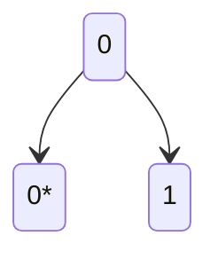
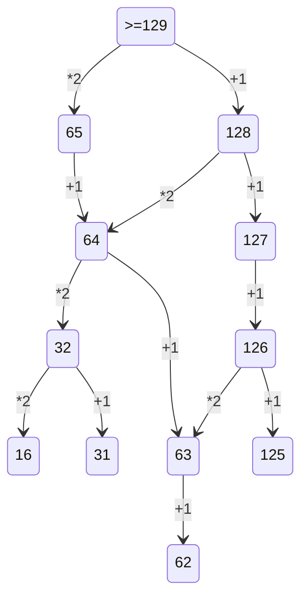

2 Задание: очень легко, просто запомнить логику

1)Сгенерировать все возможные сочетания переменных. много вложенных циклов

2)Проверить логическую функцию на условие, проверить её на ложь

3 Задание: фильтруй все столбцы таблицы.
применить фильтры по нужным значкениям
посчитать и умножить(при необходимости) на нужное количество

10 Задание: Итак, для начала нажимаем ctrl+f, в word появляется расширенный поиск, где нужно указать нужные параметры поискаи далее нам покажет, сколько раз это слово встречается в данном файле.

4 Задание: Построить бинарное дерево с известными данными, определить кол-во нужных символом для кодировки, начать кодировку с минимального набора(кода), берем минимальный код(оставшихся вариантов хватает? Если нет, то увеличиваем длину кода.
важно помнить про прямое условие фано - код одного символа не может быть началом кода другого символа

посмотреть, сколько раз встречается каждая буква
на основе данных условия задать для буквы, повторяющейся наибольшее количество раз, код с минимальным количеством знаков
далее по бинарному дереву выстроить значения для других букв

5 Задание:
в python для записи бинарного вида числа используется функция bin()
пишем в цикле все условия задачи
1.) организовать цикл перебора, с нуля до нужного числа. 
2.) перевод в двоичную систему счисления(через bin и f)
3.) проверяем на условие, дописываем и заменяем нужное
4.) перевод в десятичное, проверяем на условия

#d = f '{N:B}'

6 Задание:
на python нужно нарисовать то, что задано циклом, после чего(в данном случае) можно с помощью циклов расставить точки на рисунке и посчитать те, что оказались внутри фигуры
на кумире достаточно просто нарисовать фигуру, выставить масштаб таблицы 1:1 и посчитать пересечения линий клеток внутри фигуры

7 Задание:
вспомнить формулу для вычисления нужной величины
написать формулы для случаев "до" и "после"
определить изменение данной велимчины и получить то, что требуется

8 Задание: создать цикл по количеству знаков в числе
прописать условия в циклах

9 Задание: данную задачу можно сделать и в python, но в таблице легче

обозначить выполнение 1 условия
обозначить остальные условия на основе 1-го
посчитать одновременно удовлетворяющие обоим условиям клетки

10 Задание: 
Ctrl + F в параметрах ставим галочки "учитывать регистр" + "только слово целиком"
количество результатов будет показываться

12 Задание:

13 Задание: 

14 Задание: 
a='0123456789abcde'
for x in a:
    f=int(f'123{x}5',15)+int(f'1{x}233',15)
    if  f%14 ==0:
        print(f//14)
        break
        
        
        
 15 Задание: 
 for a in range(1,1000):
    if all(((x%2==0) <= (x%3!=0)) or (x+a>=100) for x in range(1,100)):
        print(a)
        break

19 Задание:

Нужно определить точку вход, условие ваыугрыша, сколько очков нужно набрать, чтобы завершить игру.

Рассписать двоичное дерево на 4 хода.

Ответить на вопрос задачи, присвоив какой ход, кто совершает.

Стратегия на 19 Задание:
через граф расписываем и выбираем минимальное значение
на 20:
расписываем минимальное и максимальное действие
на 21: 
берем значение 20-го задания и минусуем 1(не во всех)
или берем ход вани где он делает +- 1 второй кучи, 

23 задание:

from itertools import product
def f23(x,y,z):
    count=0
    for i in range(1,z):
        nums=product('12',repeat=i)
        for numb in nums:
            #numb=''.join(n)
            a=x
            if x==10 and numb.count('2')>1:continue
            for ii in numb:
                if a==17: break 
                if ii=='1':a+=1
                elif ii=='2' :a*=2

            if a==y: count+=1
    return count
                
print(f23(1,10,10)*f23(10,35,25))

27 задание:
а.) из-за того, что мало станций, можно использовать перебор. 
загружаем данные файлы в список, избавляемся от первого элемента.
создаем переменную с длиной списка(позже список видоизмениться)
сдваиваем список, используя разрез меняем список для работы, таким образом, чтобы километр для которого мы считаем стоимость доставки стоял на первом месте.
когда создаем новый список, мы обнуляем стоимость(не должна накапливаться на двух списках)

Считаем стоимость доставки(по известной формуле), создаем переменную для пересчета индексов элементов после середины списка (от длины списка отмнимаем индекс элемента) считаем стоимость накопления, найденную стоимость на каждом километре добавляем в новый список
выводим индекс минимального элемента списка со стоимостью + 1
б.) вместо перебора используем метод итерации(приближения), с каждым шагом приближаемся к точному, определенному значению(решению). 
вся программа находиться в бесконечном цикле. выход из него надо взять точное решения
большой цикл перебора состоит из трех переменных, старта финиша и шага.
шаг настравается таким образом, чтобы было двадцать равнораспределенных замеров по всей дороге
после каждого прохода цикла старт, финиш и шаг пересчитываются(определяем минимальную стоимость и километраж среди 20 значений)
новая граница диапазона поиска - километр - шаг и километр + шаг
после перерасчета старта и финиша перерасчитывается шаг, берем целую часть от деления на 10, когда шаг нулевой - присваиваем значение единицы
